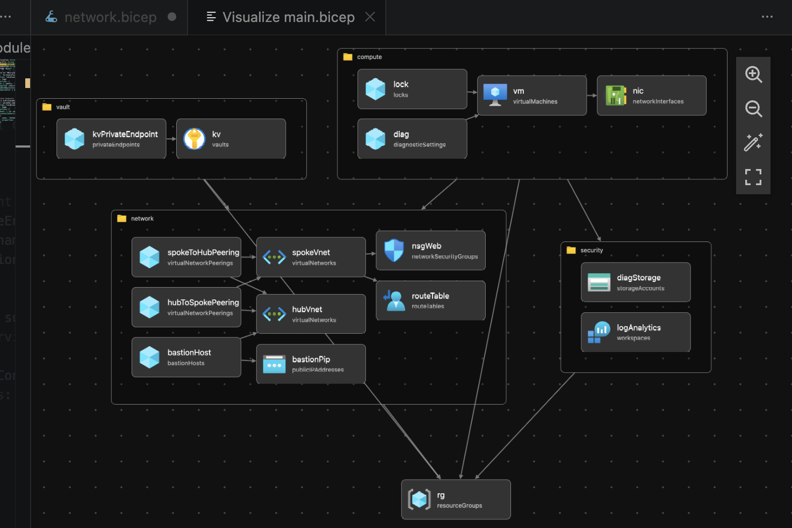

# Azure Enterprise Hardened Landing Zone (Zero-Trust Foundation & SecOps Lab)

### Objective

This repository deploys an **Enterprise-Grade Cloud Foundation** in Azure using Bicep. It follows the **Microsoft Cloud Adoption Framework (CAF)** and **Zero-Trust principles** to build a "Hardened Shell" for production workloads.

This project serves as a comprehensive SecOps lab for demonstrating Identity-based access, Perimeter Security, and Governance-as-Code.

### Architecture Overview:

* **Hub-Spoke Topology:** Centralized management plane via Hub VNet and Azure Bastion.
* **Perimeter Security:** User-Defined Routes (UDR) for forced-tunneling and "Default-Deny" NSGs.
* **Identity & Access (IAM):** System-Assigned Managed Identity for VMs and RBAC-only access for Key Vault.
* **Private Connectivity:** Key Vault isolation via Private Endpoints (Private Link).
* **Observability:** Centralized Log Analytics Workspace (LAW) with diagnostic pipes from all resources.

### Infrastructure as Code (IaC) Components

| Module | Purpose | Security Feature |
| -------- | -------- | -------- |
|security-center.bicep	| Central Logging	| Log Analytics Workspace (LAW) & Immutable Diag Storage. |
|vnet-hub-spoke.bicep	| Network Mesh	| Hub-Spoke Peering, Bastion Host, and UDR Route Tables. |
|vault.bicep	| Secret Management	| Private Endpoint (No Public Access) & RBAC Authorization. |
|compute-hardened.bicep	| Workload Protection	| System Identity, No Public IP, and CanNotDelete Resource Locks. |

### How to Deploy:

```bash
az login
az deployment sub create \
  --location centralindia \
  --template-file main.bicep

```

## SecOps: Day 2 Operational Configurations
Beyond the Bicep deployment, this lab includes documented manual configurations for:

* **Microsoft Defender for Cloud:** Enabling security posture management (CSPM).
* **Just-In-Time (JIT) Access:** Restricting management ports via adaptive network hardening.
* **Azure Policy:** Assigning the "Azure Security Benchmark" for continuous compliance auditing.
* **Disk Encryption:** Implementing Azure Disk Encryption (ADE) via the Hardened Key Vault.

## Visual Documentation

### Architecture Diagram (VS Code)
 


### Network Watcher Topology:


### Resource Lock Verification: 

[Insert Screenshot of the "Access Denied" error when trying to delete the VM]

### Private Link Verification: 

[Insert Screenshot showing Key Vault has 0 Public IP access]

