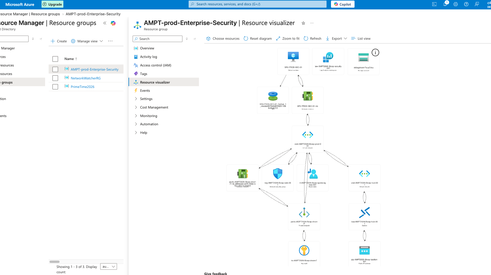
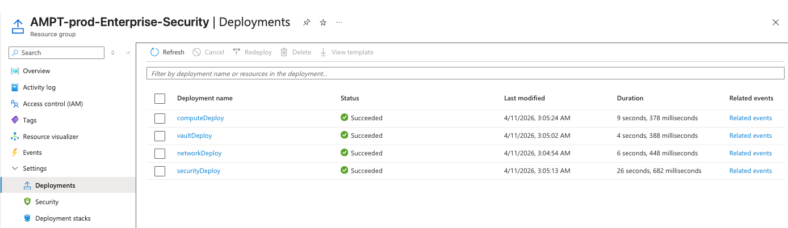
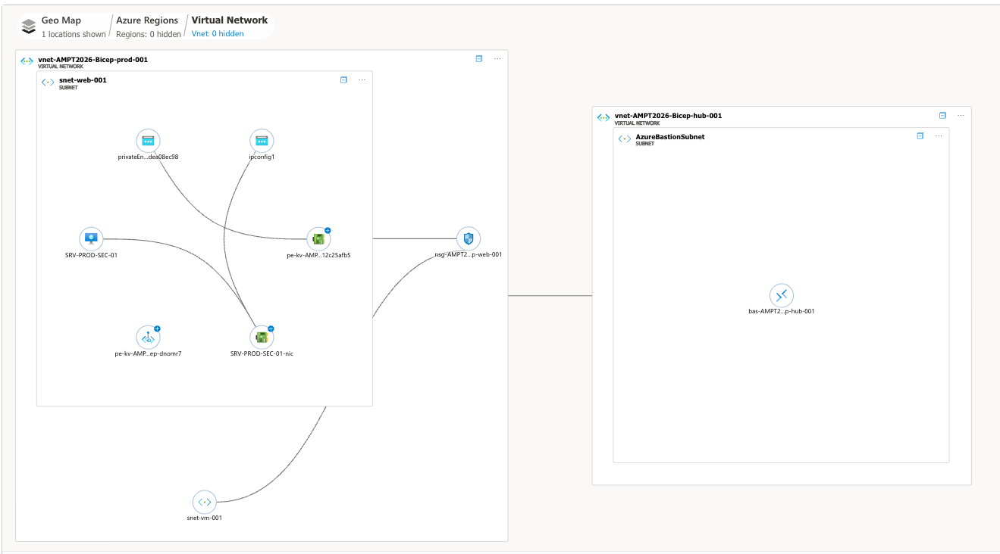
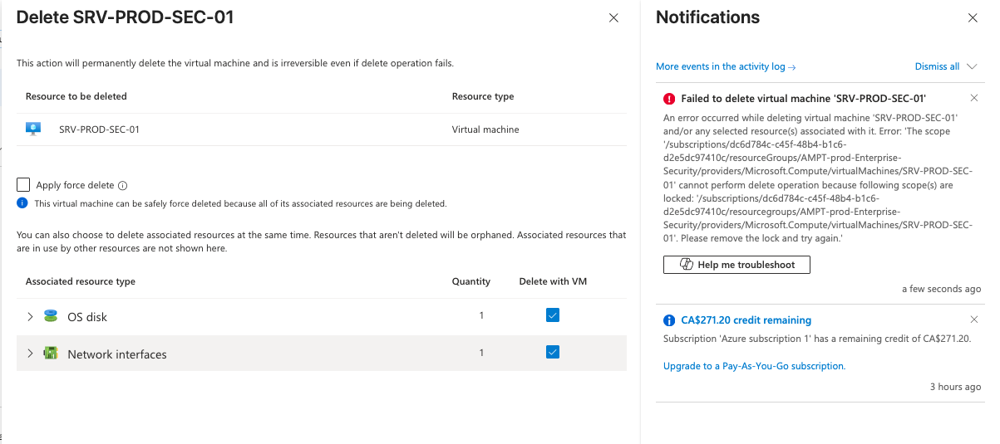
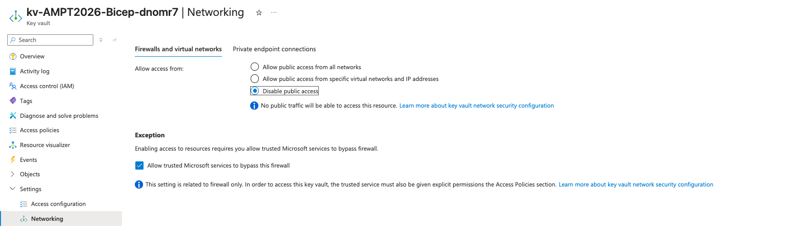

# Azure Enterprise Hardened Landing Zone (Zero-Trust Foundation & SecOps Lab)

### Objective

This repository deploys an **Enterprise-Grade Cloud Foundation** in Azure using Bicep. It follows the **Microsoft Cloud Adoption Framework (CAF)** and **Zero-Trust principles** to build a "Hardened Shell" for production workloads.

This project serves as a comprehensive SecOps lab for demonstrating Identity-based access, Perimeter Security, and Governance-as-Code.

### Architecture Overview:

* **Hub-Spoke Topology:** Centralized management plane via Hub VNet and Azure Bastion.
* **Perimeter Security:** User-Defined Routes (UDR) for forced-tunneling and "Default-Deny" NSGs.
* **Identity & Access (IAM):** System-Assigned Managed Identity for VMs and RBAC-only access for Key Vault.
* **Private Connectivity:** Key Vault isolation via Private Endpoints (Private Link).
* **Observability:** Centralized Log Analytics Workspace (LAW) with diagnostic pipes from all resources.

### Infrastructure as Code (IaC) Components

| Module | Purpose | Security Feature |
| -------- | -------- | -------- |
|security-center.bicep	| Central Logging	| Log Analytics Workspace (LAW) & Immutable Diag Storage. |
|vnet-hub-spoke.bicep	| Network Mesh	| Hub-Spoke Peering, Bastion Host, and UDR Route Tables. |
|vault.bicep	| Secret Management	| Private Endpoint (No Public Access) & RBAC Authorization. |
|compute-hardened.bicep	| Workload Protection	| System Identity, No Public IP, and CanNotDelete Resource Locks. |

### Security Architecture Decisions

* **Decision 1:** Secure Parameterization. "Used @secure() decorators for all administrative credentials to ensure zero exposure in deployment logs and metadata."

* **Decision 2:** Automated Hardening. "Leveraged the CustomScript extension to enforce an immediate password change policy (chage -d 0) upon the first interactive login, mitigating 'Day 1' credential risks."

* **Decision 3:** Observability-by-Design. "Every compute resource is deployed with a pre-configured diagnostic pipe to a centralized Log Analytics Workspace for immediate SIEM ingestion."

* **Decision 4:** Private Link Integration. "Bypassed the public internet entirely for Key Vault access by implementing Azure Private Link. This ensures that even if an attacker had valid credentials, the vault remains physically unreachable from outside the private VNet mesh.

### How to Deploy:

```bash

az login
az deployment sub create \
  --location centralindia \
  --template-file main.bicep \
  --parameters parameters.json
  
* input the username and password when prompted
```

## SecOps: Day 2 Operational & Governance Configurations
Beyond the Bicep deployment, this lab includes documented manual configurations for:

* **Microsoft Defender for Cloud:** Enabling security posture management (CSPM).
* **Just-In-Time (JIT) Access:** Restricting management ports via adaptive network hardening.
* **Azure Policy:** Assigning the "Azure Security Benchmark" for continuous compliance auditing.
* **Disk Encryption:** Implementing Azure Disk Encryption (ADE) via the Hardened Key Vault.

Unlike traditional deployments, this lab focuses on Operational Sustainability using the following "Modern SecOps" pillars:

* **Encryption at Host (The ADE Successor):** Moving beyond legacy ADE, this architecture utilizes Encryption at Host to ensure that temporary disks, OS caches, and data disks are encrypted at the source with zero performance impact.
* **Microsoft Defender for Cloud (CSPM):** Automated onboarding to the Defender for Cloud portal to monitor the "Security Score" and remediate high-risk findings (like open management ports).
* **Adaptive Network Hardening (JIT):** Documentation for implementing Just-In-Time (JIT) access. This ensures that Port 22/3389 are "Closed by Default" and only opened via a time-limited, RBAC-approved request.
* **Policy-as-Code (Azure Security Benchmark):** Integrated guidance on assigning the ASB (v4) initiative to the Resource Group. This ensures any resource that drifts from the security baseline is flagged as "Non-Compliant" automatically.

## Visual Documentation

### Architecture Diagram (VS Code)
 




### Network Watcher Topology:





### Resource Lock Verification (Lock Test): 



### Private Link Verification: 



### Key Vault (Managed Identity)


### NSG Flow 


### Azure Monitor

